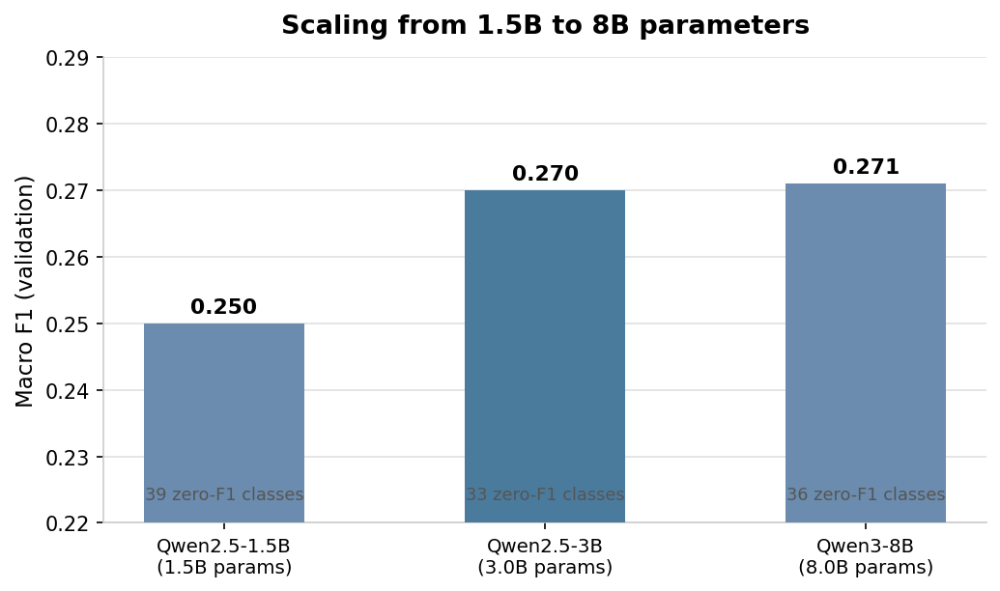
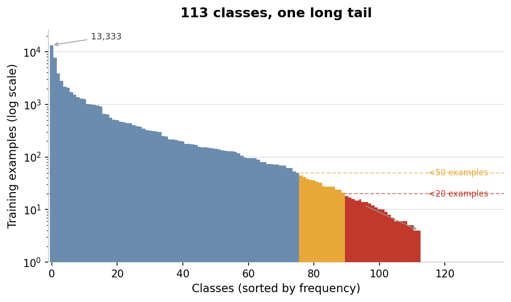
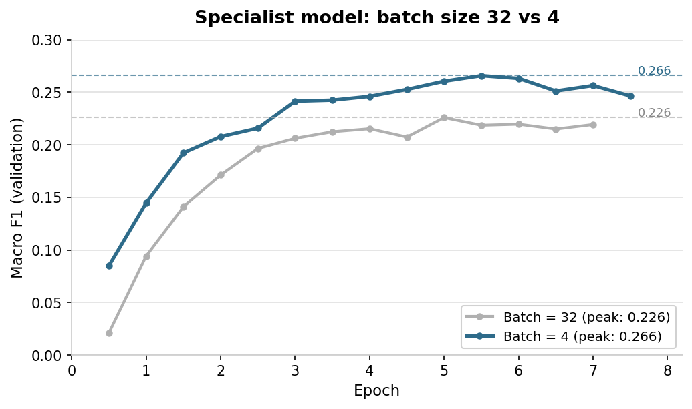

# You Can't Scale Your Way Out of a Data Problem

I fine-tuned a Qwen3-8B on a 113-category consumer complaint classification task with a severe long tail using the same basic LoRA classification setup I used on the smaller models (rank 16, alpha 32, classification head). It scored 0.271 macro F1. The Qwen2.5-3B scored 0.270.

Nearly three times the parameters bought me 0.001. These are single runs, not averaged across seeds, so that difference is probably noise. The directional finding is what matters: the 1.5B scored 0.250, the 3B scored 0.270, the 8B scored 0.271. The curve flatlined.

I did not exhaust every way to make the 8B work better. A different LoRA rank, focal loss, class weighting, or aggressive oversampling might have moved the number. I did not test the imbalance-targeted variants on the 8B. I did test class weighting on the encoder, where it helped — but not enough to close the gap. What I can say is that under a fixed fine-tuning setup — same stratified split, same objective, same early stopping on macro F1 — naive parameter scaling bought almost nothing.

The dataset explains why. The biggest class has 13,000 training examples. Dozens of classes have fewer than 20.

Under macro F1, performance on a class with 7 examples matters as much as performance on a class with 13,000. The 8B probably has the capacity to represent all 113 categories. But it sees those 7 examples at the same frequency regardless of its size. The capacity is there. The learning signal is not.

On ModernBERT-base (149M parameters), I got a larger improvement from a training regime change. This is an encoder, so not an apples-to-apples parameter comparison with the decoder runs. I am not arguing that a 149M encoder is intrinsically better than an 8B decoder. I am arguing that on this task, changing the training regime moved the metric more than scaling the decoder did. A specialist model trained on the 107 non-head classes peaked at 0.226 macro F1 with batch size 32. I dropped the batch to 4 and it peaked at 0.266. Same model, same data, same loss function. With batch 32, a class with 7 examples can only influence a small number of updates per epoch. At batch 4, it can influence many more. In practice, that was enough.

I also tried decomposing the problem. One encoder routes complaints into the 6 dominant categories or "other." A second encoder trains only on the remaining 107 classes — the head classes removed entirely from its training set, so it cannot predict them at all. At inference, the router either predicts one of the 6 head classes directly or passes the example to the specialist for one of the remaining 107 labels. The router hit 0.695 macro F1 on its 7-class problem. The specialist, freed from the optimization pressure imposed by dominant classes, reached 0.266 on its 107-class subset. The combined cascade scored 0.262 on all 113 classes — lower because routing errors lose examples permanently. A complaint that the router sends to the wrong head class never reaches the specialist. For this dataset, removing head classes from the specialist's training set was not enough to overcome that compounding error. On a problem where head classes more aggressively distort the specialist's representations, the tradeoff might go differently.

Two copies of ModernBERT-base, 298M total parameters, 42 minutes on a free Colab GPU, within 0.009 macro F1 of a decoder nearly 30 times its size that trained for 29 hours.

None of this means bigger models are useless for classification. On balanced tasks, on tasks where label semantics are subtle, or in zero-shot settings, scale can help. What it means is that on this long-tail supervised classification task, the binding constraint was not capacity. It was getting scarce classes to meaningfully shape the updates. Batch size and problem decomposition moved that constraint. Model size did not.

---

## Appendix: Experiment Summary

**Task:** 113-class consumer complaint classification (CFPB). 57,846 train / 6,430 val, stratified split, seed=42. Macro F1 on validation set. Early stopping on macro F1, patience 3-4 eval steps.

**Scaling curve (LoRA + classification head, cosine schedule):**

| Model | Params | LR | Batch | Macro F1 | Zero-F1 | Hardware | Time |
|---|---|---|---|---|---|---|---|
| Qwen2.5-1.5B | 1.5B | 2e-4 | 128 | 0.250 | 39 | Blackwell 95GB | 29m |
| Qwen2.5-3B | 3B | 2e-4 | 64 | 0.270 | 33 | Blackwell 95GB | 39m |
| Qwen3-8B | 8B | 1e-4 | 16 | 0.271 | 36 | Mac M4 128GB | 29h |

Single runs. LoRA rank=16, alpha=32, targets=q/k/v/o, classification head via `modules_to_save=["score"]`. Max sequence length=128 for decoders.

**Encoder experiments (ModernBERT-base, 149M, full fine-tune):**

| Variant | Batch | Macro F1 | Zero-F1 | Time |
|---|---|---|---|---|
| Vanilla (3 ep) | 32 | 0.209 | 46 | 32m |
| + class weighting + label smoothing + 256 tokens | 64 | 0.241 | 37 | 13m |
| Cascade specialist, batch=32 | 32 | 0.226 | 42 | 6m |
| Cascade specialist, batch=4 | 4 | 0.266 | 32 | 25m |
| **Cascade combined (router + specialist b=4)** | — | **0.262** | **33** | **42m** |

Router: 7-class (6 head + OTHER), 0.695 macro F1 at epoch 7.5. Head class threshold: ≥2,000 training examples. Specialist trained on 107 non-head classes only.

Class weighting: sqrt-inverse frequency, normalized to mean=1. Label smoothing: 0.1. Cosine schedule, 15% warmup. Grad norm clipping at 1.0. Max sequence length=256 for encoder runs.

**Not tested on the 8B:** focal loss, class weighting, oversampling, smaller batch sizes.

*All runs used the same canonical stratified split (57,846 train / 6,430 val, seed=42) and early stopping on validation macro F1.*
