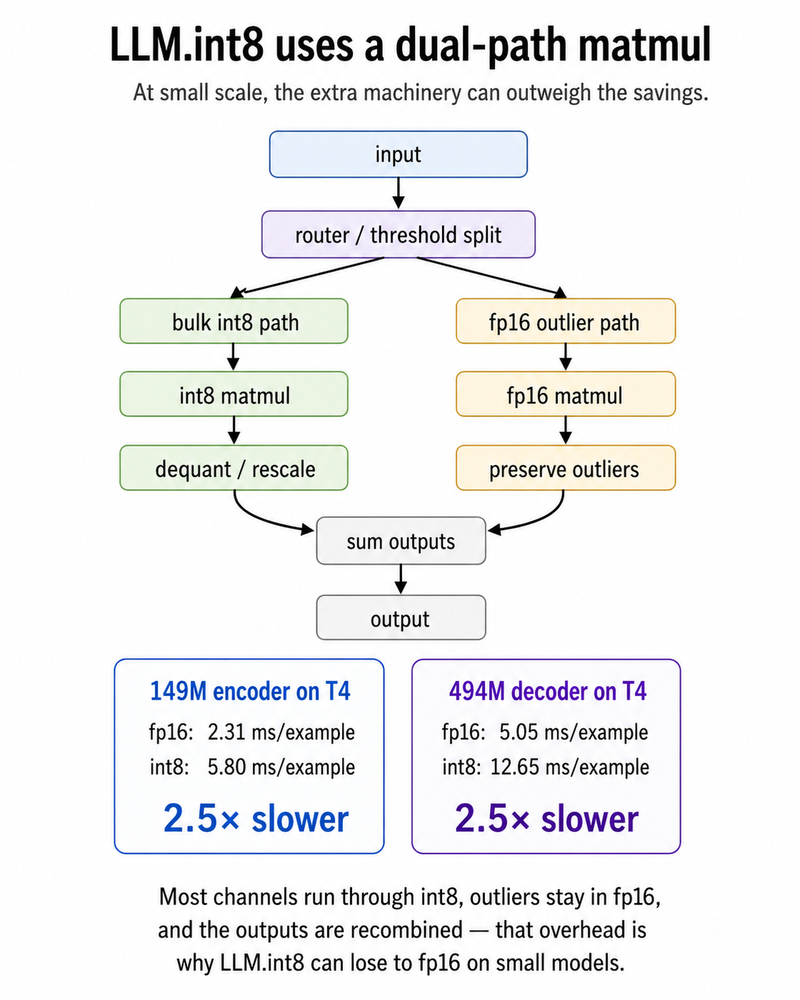

# Your int8 Quantization Is 2.5× Slower Than fp16

The LLM.int8 paper from 2022 told you this would happen. The blog tutorials skip that part.

## The number

Two fine-tuned models on a Kaggle T4 — a 149M ModernBERT encoder and a 494M Qwen decoder, both trained on a [113-class consumer-complaint task](https://earino.github.io/applied-deep-learning/site/blog/07_half_a_percent). Each loaded at fp16, int8 (LLM.int8 via bitsandbytes), and int4 (NF4 + double quant). Same task, same eval set, same T4.

| | fp16 | int8 | int4 |
|---|---:|---:|---:|
| Encoder (149M) latency, ms/example | 2.31 | **5.80 (+151%)** | 3.19 (+38%) |
| Encoder peak VRAM, GB | 0.41 | **0.59 (+44%)** | 0.62 (+51%) |
| Decoder (494M) latency, ms/example | 5.05 | **12.65 (+150%)** | 7.92 (+57%) |
| Decoder peak VRAM, GB | 1.15 | **1.87 (+63%)** | 1.89 (+64%) |

int8 is 2.5× slower than fp16 on the encoder. 2.5× slower on the decoder. Peak VRAM goes *up*, not down — by 44% and 63%. Macro F1 stays flat.

The pitch is: smaller weights, lower peak VRAM, faster inference. The reality at this scale: smaller weights, yes — but more peak VRAM, and 2.5× slower.

int4 (NF4 + double quant) is also slower than fp16 — 38% slower on the encoder, 57% slower on the decoder. The penalty is smaller than int8 because NF4 has a simpler kernel path: no outlier-vs-bulk decomposition, just straight per-matmul dequantization. But "less slow" is not "fast." At this scale, fp16 still wins both axes.

*(Peak VRAM here means CUDA peak allocated memory during the evaluation loop, captured via `torch.cuda.max_memory_allocated` after a `reset_peak_memory_stats()`. Not the on-disk weight size; not a theoretical weight-only calculation.)*

*(Scope: "int8" in this post means the LLM.int8 algorithm via bitsandbytes — the path the tutorials use. TensorRT-LLM, ONNX Runtime int8, AWQ, GPTQ, and PyTorch native quant are different code paths with different performance profiles. The findings below are about this specific dequant-and-FP16-matmul kernel, not about int8 the bit width.)*

## What the paper actually says

The LLM.int8 paper does not hide this. From the runtime discussion in the body:

> *"The quantization overhead can slow inference for models with less than 6.7B parameters, as compared to a FP16 baseline."*

The 6.7B threshold is named explicitly. The paper's primary contribution is *memory* for very large models — making 175B-class checkpoints accessible on consumer GPUs — not inference speed for small ones. The runtime caveat is honest about that.

149M and 494M are both firmly below 6.7B — 45× below and 14× below, respectively. The algorithm was running in exactly the regime the paper named.

## Why

LLM.int8 is a mixed-precision algorithm. Each matrix multiply splits into two paths: a bulk int8 path for the well-behaved weight columns, and a small fp16 path for the outlier columns whose magnitudes lose too much information at int8. The two outputs sum at the end.

That decomposition pays off at very large scale. Storing most weights at one byte instead of two roughly halves the weight memory, and the small fp16 outlier path keeps the columns that the int8 path can't represent without losing accuracy.

It is also, at small scale, expensive. Each matmul now does two passes plus dequantization plus a sum. The savings from "most of this is int8" are dominated by the overhead of the routing and dequant logic. The crossover where the savings start to beat the overhead is roughly the 6.7B threshold the paper names.

The peak VRAM going *up* is the same effect on the memory side. Weight storage does drop — int8 weights are half the bytes of fp16. But peak VRAM at small scale isn't dominated by weights; it's dominated by **the algorithm's per-matmul scratch space**. Each matmul allocates a dequantization buffer, and the fp16 outlier path runs alongside the int8 path with its own activation memory. (Per-row and per-column scaling constants also sit in memory for re-scaling, but those are small relative to activation buffers.) The encoder's 0.41 → 0.59 GB jump is the dual-path overhead, not the model getting bigger.

## What bitsandbytes IS for

bitsandbytes is not the wrong tool. It is the wrong tool *for fast inference at this scale*. Its superpower is **memory-constrained loading and fine-tuning** — getting a model to fit on a card it otherwise wouldn't, then optionally training small adapters on top. The QLoRA recipe — load a frozen base model at int4, train a small LoRA adapter on top — is the canonical use case, and the reason bitsandbytes is so widely deployed. Without it, fine-tuning anything past about 7B on consumer-grade hardware is impractical (you can chain DeepSpeed ZeRO-3, CPU offloading, and FSDP across multiple cards, but that's a different infrastructure conversation).

The capability transfers to inference: a single T4 with bitsandbytes int4 will load Qwen 2.5 14B in 9.93 GB of VRAM with 5.70 GB of headroom and generate coherent text at ~6 tokens/s. The model loads. It runs. It would still be too slow for interactive serving (it's fine for batch enrichment or async pipelines, just not for chat-style UX).

bitsandbytes fits the model. It does not make the model fast.

> **The rule:** at small scale (under ~7B), stay fp16 for inference — the VRAM savings from int8 are not worth the latency hit. Reach for bitsandbytes when you literally can't fit fp16 in VRAM for training. That is the use case it was designed around, and the reason a 14B QLoRA fine-tune fits on a 16 GB card at all.

## The production answer

If bitsandbytes is the wrong tool for fast inference at small scale, what is the right one at large scale?

For inference at scale in 2026, you do not reach for bitsandbytes. You reach for AWQ or FP8 via vLLM, TensorRT-LLM, or SGLang. On Qwen 2.5 32B on H200, [one public vLLM benchmark](https://jarvislabs.ai/blog/vllm-quantization-complete-guide-benchmarks) reports:

| Stack | tokens/s |
|---|---:|
| AWQ + Marlin kernel | 741 |
| GPTQ + Marlin kernel | 712 |
| FP16 (no quant) | 461 |
| **bitsandbytes** | **168** |

AWQ + Marlin is 4.4× faster than bitsandbytes on this benchmark. Different tool, different job. Same toolbox.

(That 4.4× is at 32B scale on H200, in one third-party benchmark. It does not transfer 1:1 to a 149M encoder on T4. The qualitative direction does: production inference depends heavily on kernels, not just bit width. When the quantization format, kernel, model size, and hardware line up, AWQ/GPTQ-style serving stacks can be much faster than bitsandbytes.)

## The lesson

Quantization is not a monotonic trade-off. It has a scale-dependent inflection point where the overhead stops dominating the savings — and for LLM.int8, the paper named that point at 6.7B parameters.

**The meta-lesson is older than this paper: when a tutorial says one thing and the original paper says another, the paper is doing the work and the tutorial is doing the marketing. Read the paper before you trust the tutorial.**

When a tutorial promises "int8 makes your model faster," check three things before you trust it:

1. What scale was the claim measured at?
2. What kernel and framework was running underneath?
3. What does the original paper say about your scale?

For LLM.int8 via bitsandbytes specifically, on anything smaller than about 7B at inference time, the answer is: it will work, it will save *weight* memory, it will be slower. That is not a bug. It is documented. Just not in the tutorial.

---

*Numbers from Week 5 benchmarks for ECBS5200, an applied deep learning course at CEU Vienna, run on a Kaggle T4. Full materials at [earino.github.io/applied-deep-learning](https://earino.github.io/applied-deep-learning/). LLM.int8 paper: Dettmers et al., NeurIPS 2022 ([arXiv:2208.07339](https://arxiv.org/abs/2208.07339)). vLLM throughput numbers from [Jarvis Labs' vLLM quantization benchmark guide](https://jarvislabs.ai/blog/vllm-quantization-complete-guide-benchmarks).*

*Edited 2026-04-24 to clarify scope ("int8" here = LLM.int8 via bitsandbytes specifically, not int8 the bit width), tighten the peak-VRAM mechanism explanation, soften "impossible" → "impractical" for past-7B fine-tuning on consumer hardware, qualify the "too slow" claim to interactive serving specifically, and promote the meta-lesson about reading the paper before the tutorial. Original published 2026-04-22.*
