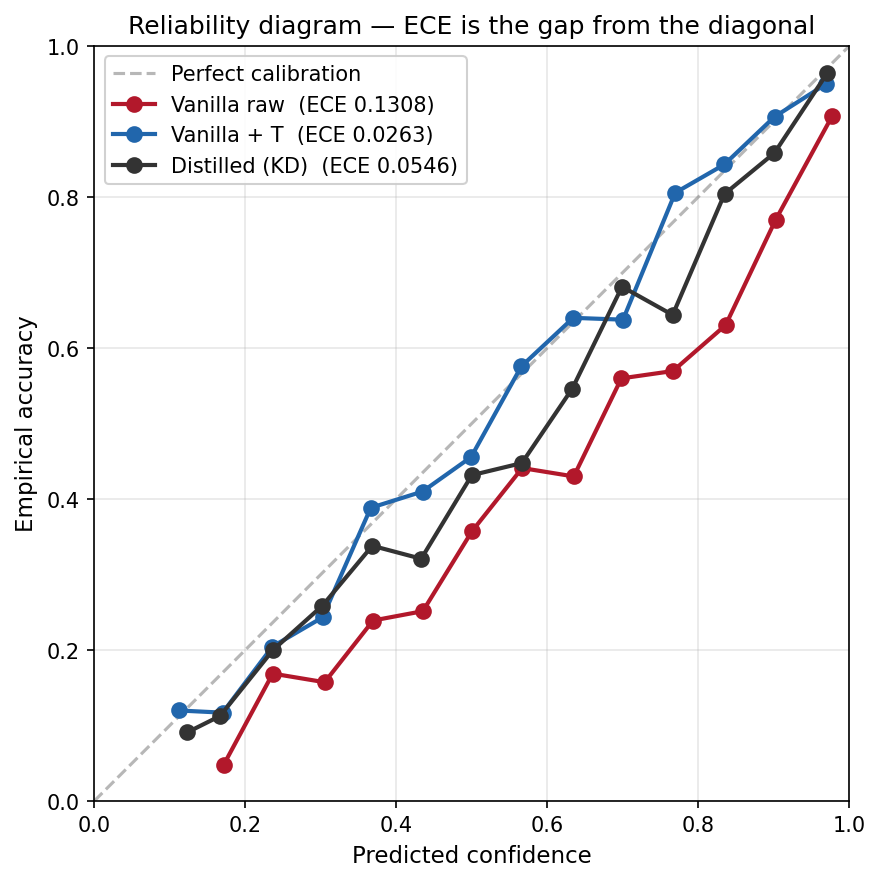
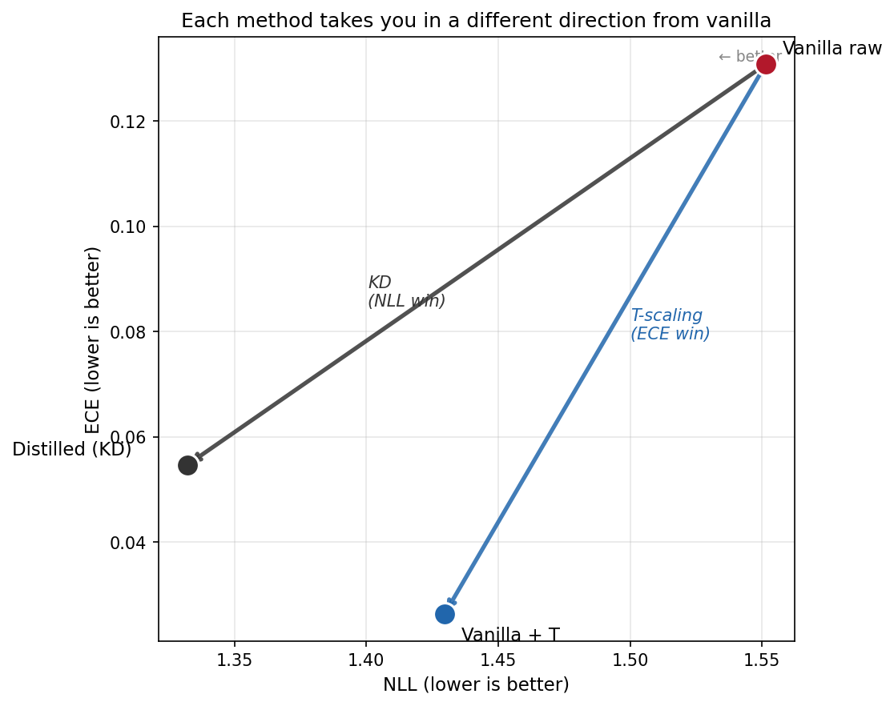

# Distillation acted like a calibration regularizer. There was a cheaper one.

I've been excited about Week 6 of this course — distillation — since the start of the term. Six weeks of fine-tuning, comparing, diagnosing, and compressing, and the experiments kept turning up things I hadn't predicted. The most important thing I learned: a one-parameter post-hoc fix beat the eighty-minute distillation run on ECE by 37%. KD only won NLL.

## The numbers

Same model, same data, same epochs, same seed. The vanilla student trained with plain cross-entropy. The distilled student trained with Hinton-style KD against Qwen3-32B at T_d=4, α=0.7. The "vanilla + T" arm is the same vanilla student with one fitted temperature scalar applied at inference. All three evaluated on the eval half of val (n=3,215).

| | ECE | NLL | Macro F1 |
|---|---:|---:|---:|
| Vanilla raw | 0.1308 | 1.5515 | 0.2833 |
| Vanilla + temperature scaling | 0.0263 | 1.4297 | 0.2833 |
| Distilled (KD) | 0.0546 | 1.3321 | 0.2872 |

T-scaling drops ECE by 0.1045. KD drops it by 0.0762. Ratio: 137%. Macro F1 is identical pre and post T-scaling because temperature scaling can't change argmax. The F1 gain from KD here is inside bootstrap noise on most tiers.

The reliability diagram on the right is how you read ECE visually. Bin every prediction by the model's claimed confidence (X axis). For each bin, plot how often the model was actually right (Y axis). Perfect calibration puts every point on the dashed diagonal — when the model says 70%, it's right 70% of the time. ECE is the average gap between curve and diagonal.

Vanilla raw (red) sits well below the diagonal at every confidence level — when it claims 60% confidence, it's right around 45% of the time. Overconfident across the board. Vanilla + T (blue) pulls the whole curve back onto the diagonal: one fitted scalar, no retraining, calibration recovered. Distilled (gray) closes part of the gap but doesn't reach the diagonal.

## Why ECE moves and NLL doesn't

Temperature scaling divides every logit by a positive scalar and re-softmaxes. Dividing all logits by the same number doesn't change which one is largest, so accuracy stays put. The probability ratios shift in a specific way: `p_i / p_j` becomes `(p_i / p_j)^(1/T)`. It sharpens or flattens the whole distribution at once.

ECE asks whether top-1 confidence tracks empirical accuracy. A single global rescale is exactly the operation that pulls those two onto the same line.

NLL is different. It penalizes probability placed on wrong classes too, not just miscalibration on the winning one. T-scaling can't push class 53's mass toward class 12 on one example and toward class 89 on another. The rescaling is global, not per-example. KD trains against the teacher's full softmax for each example. T-scaling never sees that information. That is the cleanest explanation for KD's NLL win here.

The scatter on the right plots the same three runs on a 2D plane. NLL on the X axis, ECE on the Y axis, lower is better on both — so the bottom-left corner is where you want to be.

Each method takes you in a different direction from vanilla raw (upper right). T-scaling pulls you straight down: ECE collapses, NLL barely moves. KD pulls you diagonally: NLL drops further than T-scaling reached, but ECE drops less. You cannot reach Vanilla+T's corner with KD, and you cannot reach Distilled's corner with T-scaling. The two methods occupy different corners of the plane because they fix different things.

## Han Guo 2021 explains why this works

Han Guo, Pasunuru, and Bansal at RepL4NLP 2021 made the connection between KD and temperature scaling explicit. The KD loss `KL(P(x; θ*, T) || P(x; θ, T))` with `P(x; θ, T) = softmax(f(x; θ)/T)` is the same softening operation as post-hoc T-scaling. They then ran a different experiment: calibrate the teacher with T-scaling, distill into a student, ask how much of the teacher's calibration improvement carried over. About 111% in their setup. The student inherited the teacher's calibration faithfully.

We skipped the teacher step entirely. Fit T directly on a vanilla student, compare to a distilled student. The shared mechanism made this a natural thing to try; on this 149M classifier, the direct T-scaling comparison gave 137%. Han Guo got 111% on theirs; we got 137% on ours.

## What I'd ship

If the downstream gates on a confidence threshold — auto-route above T, escalate below — try T-scaling first. It costs one scalar and a calibration fold. If it hits the target, you're done, and you saved eighty minutes of T4 time.

If the downstream uses the full distribution — top-k routing, reranking, ensembling, uncertainty-aware decisions, or a later distillation step where this student becomes someone else's teacher — KD earns the training cost. T-scaling can't shape per-example non-top-1 mass.

I see "is it calibrated?" treated as one question all the time. ECE and NLL respond to different operations because they measure different things. A method that wins one doesn't have to win the other. On this setup, the cheap method wins one and the expensive one wins the other.

## Caveats

The 137% is on a 149M student, a 113-class long-tail task, T_d=4, α=0.7, on T4 hardware. Han Guo got 111% on different tasks. I would not expect the exact magnitude to survive a change in model, task, class balance, teacher, KD temperature, or calibration split. The mechanism that should generalize is narrower: KD can reshape per-example non-top-1 mass, and T-scaling cannot.

T-scaling isn't literally free. It needs a held-out fold to fit. On small datasets that's a real cost worth thinking about.

And: this is Hinton-style KD with full softmax targets and real per-example distributional transfer. If "distillation" in your stack actually means training a student on the teacher's argmax outputs, which is what most closed-API "distillation" actually is, the NLL win does not generalize. That recipe throws away the non-top-1 probabilities that explain the NLL win here.

## Reproduce

Three Hugging Face repos.

- Vanilla student + val predictions: [`earino/ecbs5200-week6-vanilla-baseline`](https://huggingface.co/earino/ecbs5200-week6-vanilla-baseline)
- Distilled student + val predictions: [`earino/ecbs5200-week6-distilled-student`](https://huggingface.co/earino/ecbs5200-week6-distilled-student)
- Teacher logits, Qwen3-32B on train+test, fp16: [`earino/ecbs5200-week6-teacher-logits`](https://huggingface.co/datasets/earino/ecbs5200-week6-teacher-logits)

Free Kaggle T4 account is enough. The numbers come back to four decimals.

---

*From Week 6 of ECBS5200 at CEU Vienna. Both students are ModernBERT-base (149M parameters). The teacher is Qwen3-32B with a LoRA adapter trained on train+test combined, post-hoc temperature-scaled to T=1.25. Temperature scaling on the vanilla student fit one scalar on the cal half of val (n=3,215) and evaluated on the eval half.*

*Hinton-style KD here is the original [Hinton, Vinyals, Dean 2015 recipe](https://arxiv.org/abs/1503.02531): soft targets via the teacher's full softmax. The post-hoc T-scaling I used comes from [Chuan Guo et al. 2017](https://arxiv.org/abs/1706.04599), a different Guo from the [Han Guo et al. 2021](https://aclanthology.org/2021.repl4nlp-1.29/) paper above. Full course materials: [earino.github.io/applied-deep-learning](https://earino.github.io/applied-deep-learning/).*
